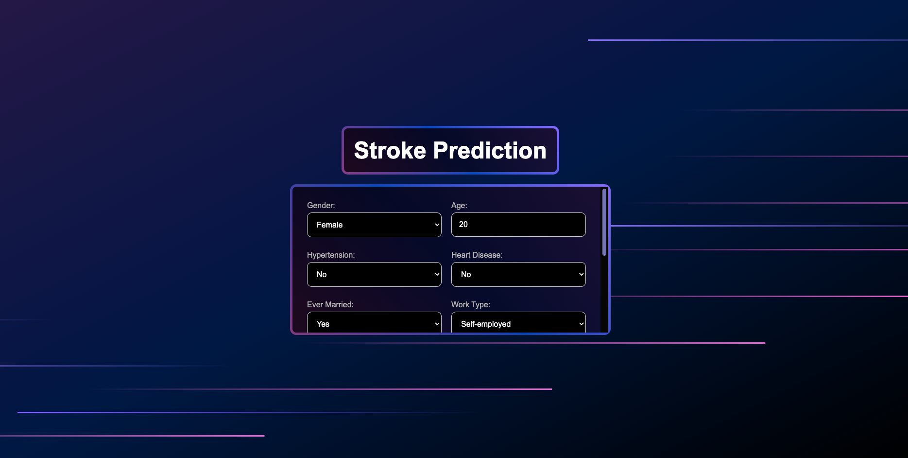

# ML WebApp for Stroke Prediction

A machine learning web application using **Flask (backend)** and **React (frontend)** to serve predictions from a trained ML model.

A trained model is loaded in the backend, served through an API, and used in a user-friendly web interface.

---

## ⚙️ How It Works

- A pre-trained ML model (Linear Discriminant Analysis) is loaded on server start
- Flask backend exposes a `/predict` API endpoint
- The model predicts based on user input from the frontend
- React frontend collects user input and sends it to the backend via API
- The result is displayed instantly on the page

---

## 🧪 Tech Stack

- **Flask** for the API backend
- **scikit-learn** for ML model loading and prediction
- **React** for the frontend interface

---

## Preview of the Interface



---

## 🚀 Running the App

### Backend (Flask)
```bash
cd flask-server
source venv/bin/activate  # Windows: venv\Scripts\activate
python server.py
```

### Frontend (React)
```bash
cd client
npm start
```

---

## 📦 Model Info

> **Model:** Linear Discriminant Analysis (LDA)  
> **ROC-AUC:** 0.837 ± 0.030

The model was pre-trained and saved as `stroke_prediction_model.joblib`.
